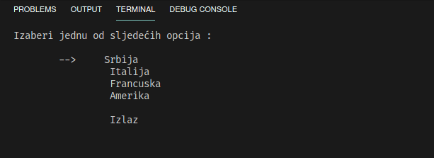

# Преглед :

# Увод

Програм је направљен у склопу пројекта из Основа Програмирања о вирусу SARS-Cov-2. Садржи основну статистику, као што је стопа морталитета, број заражених, број умрлих, као и предвиђања о раширености вируса и, ускоро, графичке приказе информација. Програм прво преузима фајл са информацијама из кога учитава најновије податке о овом вирусу за Србију, Италију, Француску и Америку. Након тога, кориснику је доступан мени који контролише прео стрелица за горе и доље, и ентера. Програм је потребно ручно компајлирати.

# Windows верзија

Да би се програм могао компајлирати, потребно је да инсталирате libcurl/curl. Ови сајтови би требали помоћи:

http://curl.haxx.se/download/libcurl-7.19.3-win32-ssl-msvc.zip

http://www.gknw.net/mirror/curl/win32/curl-7.21.3-devel-mingw32.zip

# Linux, MacOS, *nix верзија

Први корак је компајлирање програма користећи команду :

`gcc -o korona korona.c -lm -lcurl` 

Последња два аргумента служе да се повежу библиотеке. Фајл који настане компајлирањем би требало покренути, али уколико то није могуће, треба прво извршити `chmod +x korona`.

Затим, за покретање програма : `./korona`

# #ОстаниКодКуће